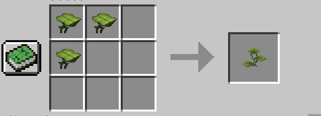
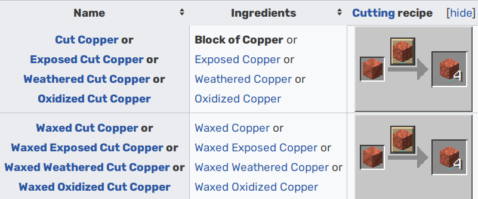
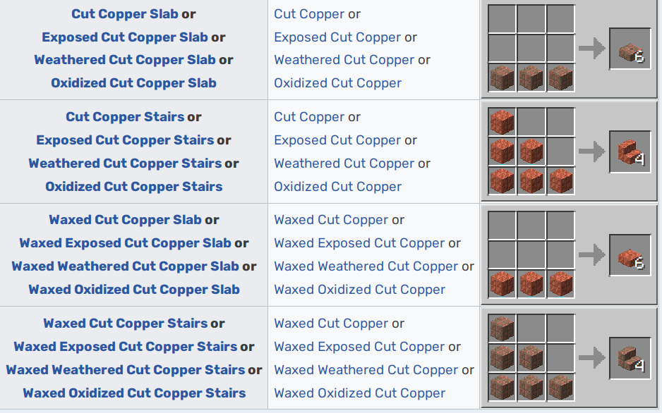

## Datapack that added some missing features in 1.17 compared to later versions
- small dripleaf recipe, make small dripleaf renewable. (shapeless crafting)

- stonecuttor recipes for blocks related to copper count fix (same as 1.18, 4 multiple ratio compare to 1.17.1 ones):

