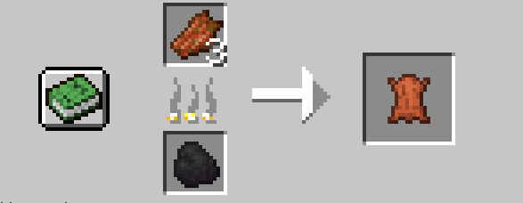
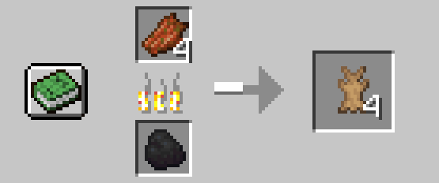

## Rotten flesh to leather

### use smoker to convert flesh into leather, no experience

### There are two versions:
- [origin version](./RFTL.zip) is directly smoke rotten flesh into leather, cost 4 burning unit time

- [rabbit hide version](./RFTL_hide.zip) is smoke rotten flesh into rabbit hide, cost 1 burning unit time and convert 4 rabbit hide into 1 leather

